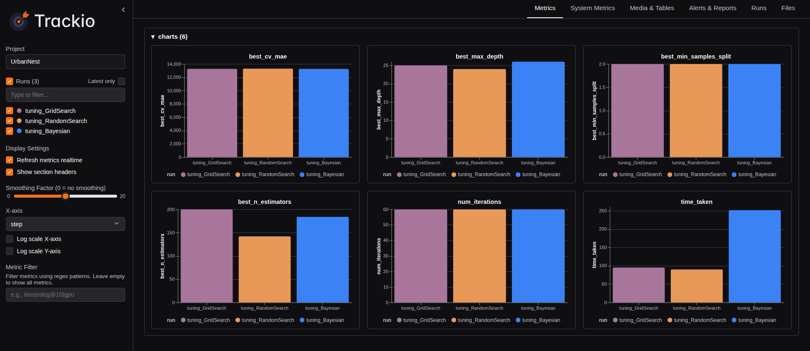
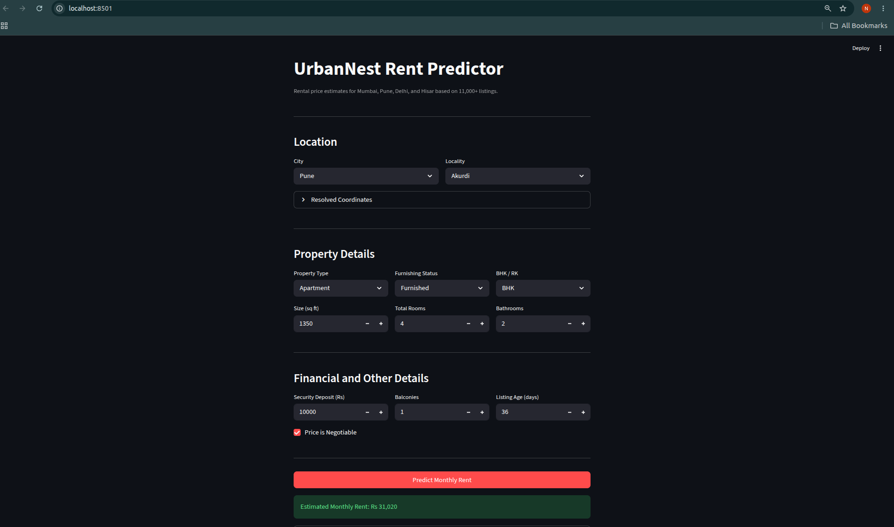
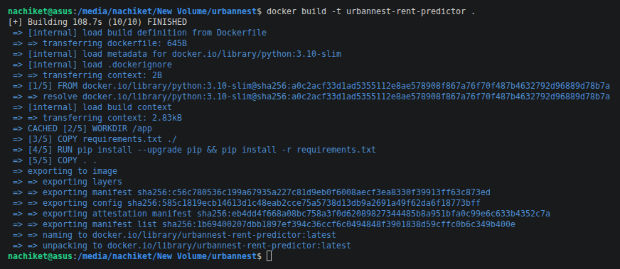
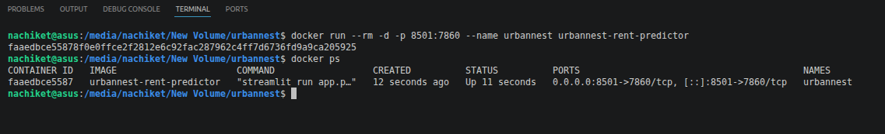

# UrbanNest Rent Predictor

Live App: https://huggingface.co/spaces/VinchuTatya/urbannest-rent-predictor

A rental price prediction engine for Mumbai, Pune, Delhi, and Hisar. Trained on 11,000+ listings using a Random Forest with three hyperparameter tuning strategies. Includes a Streamlit UI, Docker containerisation, and Hugging Face Spaces deployment.

---

## Results

| Method | CV MAE (Rs) | Time | 
|---|---|---|
| Grid Search | ~8,200 | ~4 min |
| Random Search | ~8,100 | ~2 min |
| Bayesian (Optuna) | ~7,900 | ~3 min |

Final Test MAE: ~Rs 8,000 on held-out test.csv.

---

## Project Structure

```
assignment-04/
├── app.py
├── train.py
├── train.ipynb
├── requirements.txt
├── Dockerfile
├── utils/
│   ├── preprocess.py
│   ├── tune.py
│   └── evaluate.py
├── models/
│   ├── best_rf_model.pkl
│   └── label_encoders.pkl
├── plots/
│   ├── trials_vs_error.png
│   └── optuna_hyperparameter_space.png
├── Dataset/
│   ├── train.csv
│   └── test.csv
└── screenshots/
    ├── trackio_dashboard.png
    ├── docker_build.png
    ├── docker_ps.png
    └── streamlit_working.png
```

---

## How It Works

**Training pipeline** (`train.py` orchestrates `utils/`):
- `utils/preprocess.py` — loads train.csv and test.csv, fits LabelEncoders on train.csv only, saves `label_encoders.pkl`; unseen labels at inference are handled by `safe_encode()` returning -1
- `utils/tune.py` — runs Grid Search, Random Search, and Bayesian (Optuna) with 5-fold CV, logs each run to Trackio
- `utils/evaluate.py` — generates convergence plots, picks the best method by CV MAE, trains the final model on all of train.csv, saves `best_rf_model.pkl`

**Streamlit app** (`app.py`):
- Loads model and encoders from `models/`. If they are missing or incompatible, it runs `train.py` automatically as a subprocess
- City and locality dropdowns are populated at runtime from the dataset — no hardcoded values
- Selecting a locality auto-resolves its latitude and longitude from the median coordinates in the dataset

**Notebook** (`train.ipynb`):
- Documents the same pipeline step by step with explanations, used for submission

---

## Local Setup

```bash
git clone <repo-url>
cd assignment-04
python3 -m venv .venv
source .venv/bin/activate
pip install --upgrade pip
pip install -r requirements.txt
streamlit run app.py
```

To train the model manually before running the app:

```bash
python train.py
```

---

## Docker

```bash
docker build -t urbannest-rent-predictor .
docker run --rm -p 8501:7860 urbannest-rent-predictor
```

Open at http://localhost:8501. The container exposes port 7860 internally, mapped to 8501 locally.

---

## Tech Stack

| Layer | Tool |
|---|---|
| Model | scikit-learn RandomForestRegressor |
| Tuning | GridSearchCV, RandomizedSearchCV, Optuna |
| Tracking | Trackio |
| UI | Streamlit |
| Containerisation | Docker |
| Deployment | Hugging Face Spaces |

---

## Screenshots

| Trackio Dashboard | Streamlit App |
|---|---|
|  |  |

| Docker Build | Docker PS |
|---|---|
|  |  |
